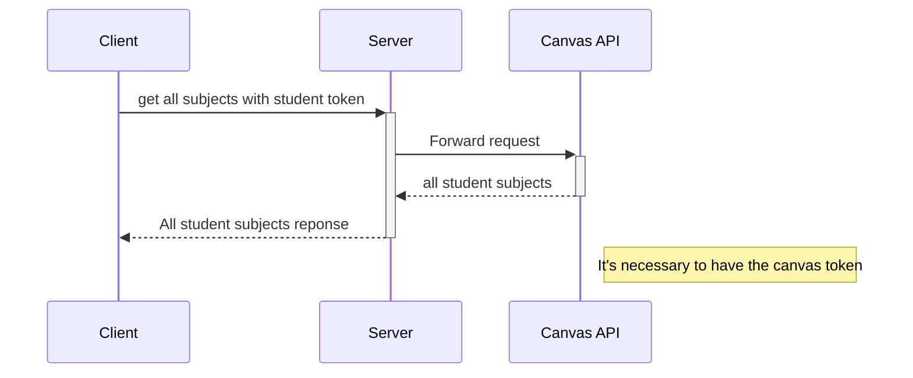
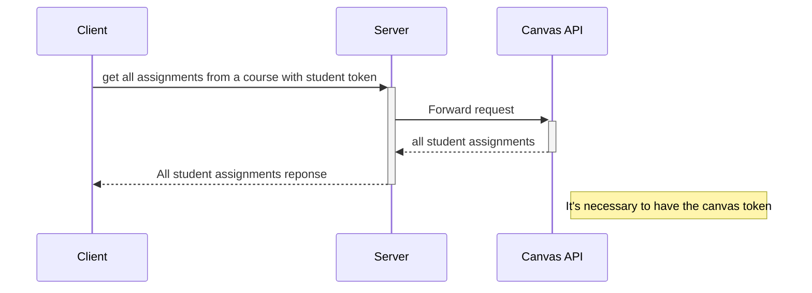
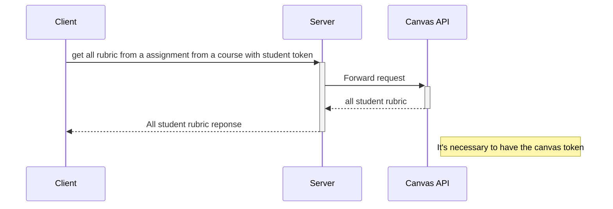
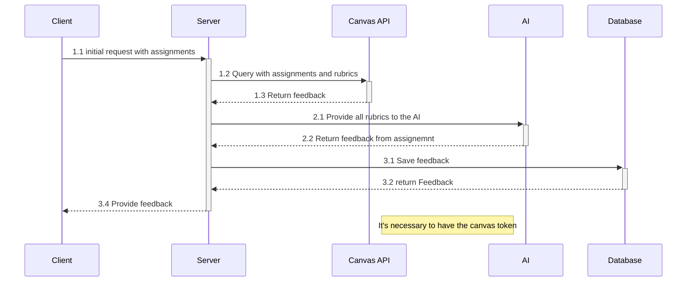

# Engenharia de Software

## Requisitos

### Requisitos Funcionais

| Requisito | Descrição                                                                                                                         | Prioridade | Caso de Uso |
|-----------|-----------------------------------------------------------------------------------------------------------------------------------|------------|-------------|
| RF01      | O sistema deve permitir o usuário selecionar a rubrica de determinada tarefa de uma matéria do curso                              | Alta       | UC01        |
| RF02      | O sistema deve permitir o usuário selecionar o estilo de correção de cada professor, para poder aumentar a eficiência da correção | Alta       | UC02        |
| RF03      | O sistema deve permitir o usuário fazer upload do PDF da tarefa a ser analisada.                                                  | Alta       | UC03        |
| RF04      | O sistema deve fornecer complementos para a tarefa se as informações no documento forem insuficientes para atingir 100% da nota.  | Média      | UC04        |
| RF05      | O sistema deve fornecer um feedback sobre as rubricas para o usuário, orientando a melhor forma de alcançar o resultado esperado. | Média      | UC05        |
| RF06      | O sistema deve salvar as análises anteriores, permitindo ao aluno revisar feedbacks e acompanhar sua evolução.                    | Baixa      | UC06        |
| RF07      | O sistema não dará um chat para comunicação direta com a IA; as informações necessárias devem ser enviadas de forma única.        | Média      | UC07        |

### Requisitos Não Funcionais

| Requisito | Descrição                                                                                                   | Prioridade | Caso de Uso |
|-----------|-------------------------------------------------------------------------------------------------------------|------------|-------------|
| RNF01     | O sistema deve ser compatível com as APIs do Canvas para obter rubricas e armazenar resultados de análises. | Alta       | UC08        |
| RNF02     | O sistema deve utilizar a API do Canvas para entender o contexto da atividade.                              | Alta       | UC08        |
| RNF03     | O sistema deve ter uma interface intuitiva e acessível, com suporte para feedback visual e textual.         | Média      | UC09        |

 
 

## Arquitetura de Informação

A arquitetura de informação (AI) para a documentação de software do nosso projeto deve ser orientada a fornecer uma
estrutura clara e intuitiva para organizar e disseminar o conhecimento técnico. Segundo Rosenfeld e Morville (2015), a
AI "envolve a concepção da estrutura e da navegação de um espaço de informação para facilitar a execução de tarefas e o
acesso ao conteúdo".

Essa estrutura de arquitetura de informação ajudará a garantir que a documentação do nosso projeto de software seja
compreensível, acessível e eficaz para os desenvolvedores e outras partes interessadas.

 
 

### Wireframe

> Link para o Figma do
> projeto: https://www.figma.com/design/TcvhoBkRxjZHyZ2wyHgVat/Project---App-Guma?node-id=0-1&p=f&t=ljwqo7oAJBbdKsnv-0

 
 

### Banco de Dados

## UML

### Casos de Uso

#### **UC01 - Seleção de Rubrica**

| **Nome**             | Seleção de Rubrica                                                                                         |
|----------------------|------------------------------------------------------------------------------------------------------------|
| **Descrição**        | O aluno seleciona a rubrica de uma tarefa específica para que o sistema entenda os critérios de avaliação. |
| **Fluxo de criação** | O aluno escolhe a matéria e a rubrica correspondente no sistema.                                           |
| **Ator**             | Aluno                                                                                                      |
| **Pré-condições**    | O aluno deve estar matriculado e ter acesso ao Canvas.                                                     |
| **Pós-condições**    | A rubrica selecionada é carregada para análise.                                                            |

#### **UC02 - Seleção do Estilo de Correção**

| **Nome**             | Seleção do Estilo de Correção                                                             |
|----------------------|-------------------------------------------------------------------------------------------|
| **Descrição**        | O aluno seleciona o estilo de correção preferido do professor para otimizar os feedbacks. |
| **Fluxo de criação** | O aluno escolhe o professor e confirma a seleção no sistema.                              |
| **Ator**             | Aluno                                                                                     |
| **Pré-condições**    | O sistema deve conter as preferências de correção cadastradas.                            |
| **Pós-condições**    | O estilo de correção do professor é aplicado na análise da tarefa.                        |

#### **UC03 - Upload de Atividade**

| **Nome**             | Upload de Atividade                                                    |
|----------------------|------------------------------------------------------------------------|
| **Descrição**        | O aluno faz o upload do arquivo da tarefa em formato PDF para análise. |
| **Fluxo de criação** | O aluno seleciona o arquivo e o envia para o sistema.                  |
| **Ator**             | Aluno                                                                  |
| **Pré-condições**    | O aluno deve ter o arquivo da tarefa salvo em formato PDF.             |
| **Pós-condições**    | O arquivo é armazenado no sistema para análise.                        |

#### **UC04 - Geração de Complementos**

| **Nome**             | Geração de Complementos                                                                         |
|----------------------|-------------------------------------------------------------------------------------------------|
| **Descrição**        | O sistema fornece sugestões para complementar a tarefa caso as informações estejam incompletas. |
| **Fluxo de criação** | O sistema analisa o arquivo enviado e apresenta sugestões diretamente ao aluno.                 |
| **Ator**             | Sistema                                                                                         |
| **Pré-condições**    | O arquivo deve estar corretamente formatado e conter informações iniciais.                      |
| **Pós-condições**    | O aluno recebe sugestões de complementação para melhorar sua nota.                              |

#### **UC05 - Feedback sobre Rubricas**

| **Nome**             | Feedback sobre Rubricas                                                                   |
|----------------------|-------------------------------------------------------------------------------------------|
| **Descrição**        | O sistema oferece feedback detalhado baseado nos critérios da rubrica selecionada.        |
| **Fluxo de criação** | O sistema gera um relatório com os pontos fortes e fracos da tarefa em relação à rubrica. |
| **Ator**             | Sistema                                                                                   |
| **Pré-condições**    | A rubrica deve estar devidamente selecionada e carregada.                                 |
| **Pós-condições**    | O aluno entende os ajustes necessários para atender às expectativas da rubrica.           |

#### **UC06 - Revisão de Feedbacks Anteriores**

| **Nome**             | Revisão de Feedbacks Anteriores                                                                  |
|----------------------|--------------------------------------------------------------------------------------------------|
| **Descrição**        | O aluno pode visualizar análises e feedbacks de tarefas anteriores para acompanhar sua evolução. |
| **Fluxo de criação** | O aluno acessa o histórico de feedbacks salvos no sistema.                                       |
| **Ator**             | Aluno                                                                                            |
| **Pré-condições**    | O aluno deve ter realizado análises anteriores no sistema.                                       |
| **Pós-condições**    | O aluno identifica padrões de melhoria em suas tarefas.                                          |

#### **UC07 - Comunicação com a IA**

| **Nome**             | Comunicação com a IA                                                                  |
|----------------------|---------------------------------------------------------------------------------------|
| **Descrição**        | O sistema processa as informações enviadas pelo aluno em um único envio para análise. |
| **Fluxo de criação** | O aluno insere as informações e as envia para o sistema realizar a análise.           |
| **Ator**             | Aluno                                                                                 |
| **Pré-condições**    | As informações devem estar completas e prontas para envio.                            |
| **Pós-condições**    | O sistema inicia a análise baseada nos dados recebidos.                               |

#### **UC08 - Integração com APIs do Canvas**

| **Nome**             | Integração com APIs do Canvas                                                                  |
|----------------------|------------------------------------------------------------------------------------------------|
| **Descrição**        | O sistema utiliza as APIs do Canvas para obter rubricas e informações contextuais das tarefas. |
| **Fluxo de criação** | O sistema se conecta ao Canvas e importa as informações necessárias.                           |
| **Ator**             | Sistema                                                                                        |
| **Pré-condições**    | O Canvas deve estar configurado para integração com o sistema.                                 |
| **Pós-condições**    | As informações do Canvas são usadas para análise e geração de feedbacks.                       |

#### **UC09 - Interface Intuitiva**

| **Nome**             | Interface Intuitiva                                                                      |
|----------------------|------------------------------------------------------------------------------------------|
| **Descrição**        | O sistema apresenta uma interface clara e acessível para facilitar a interação do aluno. |
| **Fluxo de criação** | O aluno navega pelo sistema com facilidade para realizar as ações desejadas.             |
| **Ator**             | Aluno                                                                                    |
| **Pré-condições**    | A interface deve estar implementada conforme os padrões de usabilidade.                  |
| **Pós-condições**    | O aluno realiza suas ações de forma eficiente e sem dificuldades.                        |

## Diagrama de sequência

> Buscar todas as matérias que o aluno está matriculado

> Buscar todas as ativades de uma matéria

> Buscar todas as rubricas de uma ativade de uma máteria

> Avaliar atividades

